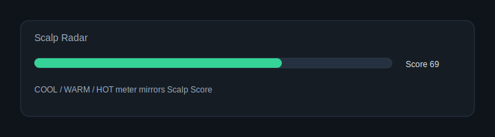
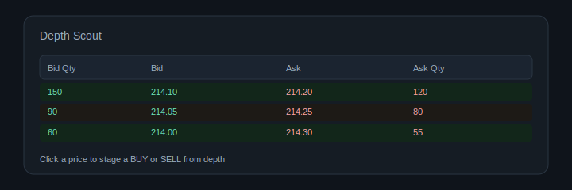
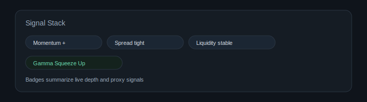

# Scalping UI Enhancements Manual

This document describes the current scalping and chart window enhancements, how they work, and how to use them for faster decision making. It covers both `scalping_interface.html` and `chart_window.html`.

Images:





Notes:

- This is decision support, not financial advice.
- The proxy signals (gamma and volatility) are estimates, not true option Greeks.
- Order placement and broker routing are unchanged. Risk gates and warnings are UI-only safeguards that can be toggled.

## Summary of Changes

1. Depth Scout panel in the scalping window and chart window.
2. Broker-aware depth levels with Dhan 20L support and automatic fallback to 5L.
3. Click-to-select depth prices and one-click BUY or SELL from depth.
4. Smart order modes: JOIN, STEP-IN, TAKE.
5. Auto reprice with configurable delay.
6. No MKT toggle to block market orders from depth actions.
7. Signal badges: Momentum, Spread, Liquidity, Gamma Squeeze.
8. Scalp Score and Scalp Radar meter in the header.
9. Alerts for HOT score, with optional audio beep.
10. Gamma Proxy and Vol Spike proxies in the depth panel.
11. Heat overlay on depth rows based on bid and ask weight.
12. Underlying index LTP subscription in chart window for Gamma Squeeze.
13. Split chart mode for CE/PE with active-side highlighting.
14. Immediate TP/SL overlays for limit/trigger lines, with drag and close support.
15. Loss banners now use live open P&L and reset on position changes.
16. Daily max loss can be warn-only or block (toggle in Risk Management).
17. Stop loss, target, trailing, and profit protection now use open P&L only.
18. Session stats now count per-trade entries (not per-symbol) and persist by date.

## Quick Start

1. Open the scalping window, connect, and load an index and expiry.
2. Click a strike row to focus the Depth Scout.
3. Pick CE or PE in the Depth Scout (scalping window only).
4. Select the depth level (5L or 20L). Dhan supports 20L.
5. Choose a mode: JOIN, STEP-IN, or TAKE.
6. Click a depth price, then press BUY or SELL.
7. Use Reprice if you want the system to chase the queue.
8. Watch the Scalp Radar and signal badges for momentum and liquidity hints.

## Depth Scout Panel

Purpose:

- Fast access to live market depth for the selected strike.
- Quick order staging from depth with minimal clicks.

Key controls:

- Depth On: enables or disables depth updates.
- Level selector: 5L or 20L.
- CE or PE side (scalping window): swaps the depth target between call and put.
- Mode buttons: JOIN, STEP-IN, TAKE.
- Reprice toggle and delay: adjust how fast limit orders are re-priced.
- No MKT toggle: prevents any market order from depth actions.

How to use:

1. Click a strike row to set the depth target.
2. Click a bid or ask price in the depth list.
3. Press BUY or SELL to stage a limit (default) or smart order.
4. If Reprice is on, the system will attempt to keep your order near the top.

## Smart Order Modes

JOIN:

- Places a limit at the best bid for BUY or best ask for SELL.
- Best for joining the queue without crossing spread.

STEP-IN:

- Places a limit one tick inside the spread (configurable via tick size).
- Best for getting priority without going fully aggressive.

TAKE:

- Crosses the spread if it is within the allowed range.
- Uses market for fast fill unless No MKT is enabled.
- Best for speed when spread is tight and momentum is strong.

## Auto Reprice

Scalping window:

- Uses cancel and replace when an order is not filled within the delay.
- Pulls open orders from orderbook and re-places with an updated price.

Chart window:

- Uses modify order where supported.

How to use:

1. Turn on Reprice.
2. Set delay in milliseconds (typical range: 200 to 600 ms).
3. Use JOIN or STEP-IN for queue chasing, TAKE for fast entry.

## Scalp Score and Scalp Radar

What it is:

- A 0 to 100 score based on momentum, imbalance, spread, liquidity, and proxy signals.
- The Scalp Radar in the header mirrors the score and shows COOL, WARM, HOT.

How to use:

1. Look for WARM or HOT readings.
2. Combine score with spread and liquidity signals before executing.

Alerts:

- Toast alerts trigger when the score crosses HOT.
- Audio beep can be enabled from the depth panel.

## Signal Badges

Momentum:

- Uses imbalance change over a short window.
- Shows direction when pressure accelerates.

Spread:

- Detects tight, wide, or compression states.
- Compression is a common pre-breakout condition.

Liquidity:

- Detects pullback in bid or ask quantities.
- Useful for spotting sudden liquidity vacuum.

Gamma Squeeze:

- Combines option proxy gamma, proxy vol, and underlying index acceleration.
- Helps identify rapid directional moves with rising volatility.

## Gamma and Volatility Proxies

Gamma Proxy:

- Based on short-term acceleration of option price.

Vol Spike:

- Based on short-term variance in option ticks.

How to use:

- Use as context only, not as true Greeks.
- Watch for HIGH levels as a warning that moves can be sharp.

## Broker Depth Levels

Dhan:

- Supports up to 20 depth levels when available.
- Selecting 20L will request 20 and display 20 when supported.

Kotak:

- Typically provides 5 depth levels.
- Selecting 20L will fallback to 5L and show a hint.

## Chart Window Specifics

Underlying index feed:

- Chart window subscribes to the underlying index LTP for Gamma Squeeze.
- Uses the exchange passed in the chart URL, not the option exchange.

Depth order placement:

- Uses the same smart modes and No MKT controls as scalping window.
- Auto reprice uses modify order in chart window.

Split chart mode:

- When opened with both CE and PE symbols, the chart renders side-by-side panes.
- Clicking a pane sets the active side; all actions (orders, overlays, depth) follow it.
- The active side badge appears next to price for clarity.

TP/SL overlays:

- When placing limit or trigger lines, TP/SL overlays appear immediately at the default offsets.
- Overlays can be dragged to refine TP/SL before fill.
- Each overlay includes a close icon to dismiss it quickly.

Loss banner:

- Loss warnings use live open P&L only and won’t trigger on stale prices.
- Automatically resets when the active position changes or closes.

## Risk Management and P&L Monitoring

Daily max loss:

- The Risk Management panel includes a toggle: “Block on daily max loss”.
- When OFF, the system only warns and continues order placement.
- When ON, orders are blocked after the daily loss limit is breached.
- Cooling-off (30 min) applies only when blocking is enabled.

Per-trade max loss (auto-exit):

- When Auto-exit is enabled, any single open position that breaches the per‑trade max loss is closed automatically.
- This uses live open P&L for each position.
- Disabling auto-exit turns off per‑trade auto closes.

Daily max loss (auto-exit):

- When Auto-exit is enabled, and total day P&L (open + closed) breaches the daily limit, all open positions are closed automatically.
- This is separate from the “Block on daily max loss” toggle (which only gates new orders).

Stop loss, target profit, trailing:

- All three use **open P&L only** (no closed P&L contamination).
- Trailing starts once target is hit, or immediately if no target is set.

Profit protection:

- Breakeven and protection tiers use open P&L only.
- Protection resets cleanly when positions are fully closed.

## Session Stats (Per-Trade)

What changed:

- Session stats now derive from per-trade entries stored locally.
- Multiple trades on the same symbol count as separate trades.

How it works:

- Each exit records a trade entry with symbol, P&L, timestamp, qty, entry, and exit.
- The list is saved in localStorage by date (YYYY-MM-DD).
- If the list is empty, the UI falls back to broker-reported closed positions.

## Performance Notes

- Depth rendering is throttled and uses cached DOM elements.
- Signals reuse small history buffers, kept intentionally short.
- No extra computation is done if depth is disabled.
- No changes to order execution logic or API endpoints.

## Tuning Thresholds

You can adjust thresholds in the state blocks if you want more or fewer signals:

- `scalping_interface.html`: `depthUnderlyingSpeedHigh`, `depthUnderlyingAccelHigh`, `depthUnderlyingMovePts`
- `chart_window.html`: `underlyingSpeedHigh`, `underlyingAccelHigh`, `underlyingMovePts`

Lowering these values will trigger Gamma Squeeze more often. Raising them makes it stricter.

## AI Scalper Backend (Server-Side Agent)

Purpose:

- High-speed server-side auto scalper for CE/PE with one-position-at-a-time logic.
- Runs inside OpenAlgo (no browser dependency), uses the WebSocket proxy feed.
- Enforces per-trade loss, daily loss, cooldowns, and data-stall fail-safe.
- Optional LLM/Advisor hook for parameter tuning (off by default).

Key capabilities:

- Momentum entry: default 3 consecutive up ticks.
- Averaging: 1 lot every 2–3 seconds, stops after 10 seconds (max 5 lots/strike).
- Trailing: 2 points distance, 1 tick step, overrides TP when enabled.
- Time guard: after 60s without momentum, exit if profit; otherwise tighten SL.
- One live position at a time; flip cooldown 5s.
- Auto-roll ATM when index moves 50 (NIFTY) / 100 (SENSEX) points.
- Expiry (after 14:00): auto OTM +3 strikes with smaller TP/SL.

Endpoints:

1. Start

```
POST /ai_scalper/start
{
  "apikey": "YOUR_OPENALGO_KEY",
  "ce_symbol": "NIFTY03FEB2625750CE",
  "pe_symbol": "NIFTY03FEB2625750PE",
  "underlying": "NIFTY",
  "exchange": "NSE_INDEX",
  "expiry": "03FEB26",
  "lot_size": 50,
  "entry_lots": 2,
  "scale_lots": 1,
  "max_lots_per_strike": 5,
  "momentum_ticks": 3,
  "tp_points": 5,
  "sl_points": 8,
  "trail_distance": 2,
  "trail_step": 0.05,
  "paper_mode": true,
  "assist_only": false,
  "trade_mode": "AUTO",
  "strike_offset": "ATM",
  "expiry_otm": true,
  "auto_roll": true
}
```

2. Stop

```
POST /ai_scalper/stop
{ "reason": "Manual stop" }
```

3. Status

```
GET /ai_scalper/status
```

4. Update (live toggles)

```
POST /ai_scalper/update
{
  "paper_mode": true,
  "assist_only": false,
  "trade_mode": "CE"
}
```

LLM/Advisor hook (optional):

- Providers supported: `openai`, `anthropic`, `ollama`, or `http` (custom URL).
- For `openai` and `anthropic`, set API keys in environment.
- For `ollama`, run Ollama locally and set `advisor_model` plus optional `advisor_base_url`.
- For custom URLs, set `advisor_provider` to `http` and pass `advisor_url`.
- If `advisor_auto_apply` is true, updates are applied automatically.
- This hook is non-blocking and can be routed to any local LLM gateway.

Notes:

- Paper mode uses sandbox execution, independent of global Analyze Mode.
- Order placement uses the same OpenAlgo order services and rate limits.
- The AutoTrade window has a "Server Agent" toggle. When ON, the AutoTrade button starts/stops the backend agent (no curl needed).
- Env keys:
  - `OPENAI_API_KEY` (OpenAI)
  - `ANTHROPIC_API_KEY` (Anthropic)
  - `OLLAMA_BASE_URL` (optional; defaults to `http://127.0.0.1:11434`)
  - `OPENAI_ADVISOR_MODEL`, `ANTHROPIC_ADVISOR_MODEL`, `OLLAMA_ADVISOR_MODEL` (optional defaults)
- The AutoTrade panel now includes provider presets and a Test Advisor button for quick checks.
- Test Advisor calls `/ai_scalper/test_advisor` and validates your provider + model before you go live.

## Operational Tips

1. Keep No MKT on during high volatility to avoid slippage.
2. Use STEP-IN with Reprice to build queue position without overpaying.
3. Use TAKE only when spread is tight and momentum is aligned.
4. Use the Scalp Radar as a quick filter, not a decision by itself.
5. Combine liquidity pullback with tight spreads to find quick entries.

## Known Limitations

- Gamma and Vol are proxies, not true Greeks.
- Gamma Squeeze depends on underlying index ticks, which can be noisy.
- Depth availability is broker specific, and 20L is not universal.

## Auto Trading Window (auto_trading_window.html)

Purpose:

- Experimental auto-entry window for momentum scalps with strict risk gates.
- Uses the same chart engine as the chart window, with a dedicated AutoTrade panel.

How to open:

1. Use the same URL parameters you pass to `chart_window.html` (symbol, exchange, expiry, CE/PE).
2. Open `auto_trading_window.html` in a separate popup or tab with those parameters.

Key controls:

1. AutoTrade On/Off: enables or disables the engine.
1. Mode: Auto (both sides), Fire CE, or Fire PE.
1. Paper Mode: toggle between paper and live trading.
1. Entry Lots (default 2) and Max Lots/Strike.
1. Momentum ticks (default 3) and minimum entry gap (ms).
1. Candle Confirm toggle + Candle Mode (EMA9 / Prev Close) + Candle Ticks (default 7).
1. Underlying Direction filter (CE only when underlying is rising; PE only when underlying is falling).
1. Relative Strength filter (only trade the side with stronger momentum count).
1. Min Flip Hold (seconds) to avoid instant whipsaws.
1. Learning toggle and Auto-Apply (parameter tuning).
1. Learning Explore (epsilon) and Tune interval (s) and Min Trades gates.
1. Telegram Alerts toggle + Entry/Exit/Tune flags.
1. Max trades/minute and cooldown after a loss.
1. Per-trade max loss and daily max loss.
1. Averaging window (s) and interval (ms).

AutoTrade Panel (Basic vs Advanced):

Basic (use these first):

- Engine: AutoTrade On/Off, Auto/CE/PE mode.
- Execution: Paper Mode (safe testing).
- Sizing: Entry Lots, Max Lots/Strike.
- Entry logic: Momentum Ticks, Candle Confirm (toggle + mode + ticks), Underlying Dir filter.
- Risk: Per‑trade Max Loss, Daily Max Loss.
- Targets: TP points, SL points.
- Status: Auto P&L/Open/Realized/Since + Entry Gate checklist.

Advanced (tune once basic is stable):

- Server Agent (LOCAL/Server) and Broker P&L (live MTM on Auto P&L).
- Presets: SENSEX/NIFTY presets + Apply.
- Advisor/LLM: LLM Advisor, Auto‑Apply, Provider, Model preset/custom, Base URL, Custom URL, Test Advisor, key status.
- Learning: Learning On, Auto‑Apply, Explore (epsilon), Tune interval, Min Trades, Replay Analyzer.
- Telegram: Alerts toggle + Entry/Exit/Tune.
- Timing: Min Gap (ms), Max Trades/min, Cooldown (s), Min Flip Hold (s).
- Targets: Trail Distance, Trail Step, Override TP.
- Breakeven/Protection: BE Delay, BE Buffer, Profit Lock (pts), Profit Lock (Rs), TP ≥ SL Guard.
- Averaging: Averaging On, Avg +PnL only, Avg Window, Avg Interval.
- Filters: Relative Strength, Imbalance Filter + ratio, Checklist, Reverse.
- Index Bias: Mode, Min Score, EMA/VWAP/RSI/ADX/Supertrend toggles, RSI bull/bear, ADX min, VWAP buffer.
- Strike/Expiry: Strike Offset, Expiry 14:00 → OTM3.
- Logs: log filter/export + Learning dashboard.

## AutoTrade Logs, Analytics, and Model Tuning (New)

Purpose:

- AutoTrade logs are now stored in a database for long-term history.
- Analytics page visualizes performance.
- Model Tuning uses logs + learning data to suggest safer parameter changes.

Where data is stored:

- `db/ai_scalper_logs.db` (trade events: ENTRY/EXIT, paper/live, local/server)
- `db/ai_scalper_ledger.db` (learning ledger)
- `db/ai_scalper_tuning.db` (model tuning runs and recommendations)

Analytics page:

- URL: `/auto-trade/analytics`
- Filters for paper/live, symbol, range.
- Shows equity curve, P&L distribution, exit reasons, side breakdown.

Model tuning page:

- URL: `/auto-trade/tuning`
- Select provider + model, then click Run Tuning.
- Paper mode can auto-apply; live mode requires manual Apply.
- Schedule runs by interval or daily time.

Required env keys (cloud providers):

- OpenAI: `OPENAI_API_KEY`, `OPENAI_ADVISOR_MODEL`
- Anthropic: `ANTHROPIC_API_KEY`, `ANTHROPIC_ADVISOR_MODEL`

Quick use:

1. Set API key + model env var.
2. Restart Flask.
3. Open `/auto-trade/tuning`, click Run Tuning.
4. Review suggestions and apply if needed.
1. Trailing distance and trail step, with "Override TP" to let winners run.
1. Imbalance filter (bid/ask ratio) with threshold input.
1. Strike offset selector and expiry-day OTM rule.
1. Suggest Only: show signals without placing orders.
1. LLM Advisor + Auto-Apply toggles (advisor updates are optional).

How it works:

1. On each tick, the engine counts consecutive ticks in one direction.
1. When enabled, the Underlying Direction filter allows CE entries only when the index is rising, and PE entries only when it is falling.
1. When enabled, the Candle Confirm filter requires the last 1-minute close to be above the previous close or above EMA9 (configurable).
1. When enabled, Relative Strength only trades the side with stronger momentum.
1. When the momentum threshold is met, it enters with a market BUY on the active side.
1. If momentum continues, it averages in 1-lot steps every 2-3 seconds for up to 10 seconds, capped by max lots.
1. Virtual TP/SL lines are created at the same offsets as the chart window and can be dragged.
1. Trailing SL moves in real time based on trail distance and step.
1. Per-trade max loss closes only that position and starts a cooldown.
1. Daily max loss closes all auto positions and disables auto trading.
1. If data stalls (no ticks), auto trading stops and closes any auto positions.
1. Time-in-trade guard: after 60s without momentum, exit on profit or tighten SL near entry.
1. Learning ledger logs entry/exit context and updates the bandit tuner on every exit.
1. When Learning Auto-Apply is on, the engine can adjust momentum/TP/SL/trail parameters at the tune interval.
1. Telegram alerts can be sent on entry/exit/tune when enabled.
1. Expiry-day profile: after 14:00/14:30/15:00, auto uses smaller TP/SL for faster moves.

Notes:

- Auto entries and exits are MARKET only.
- Auto uses the same broker endpoints and does not change execution logic.
- Paper mode in the AutoTrade window is **local-only** and does not send orders to the broker.
- Server Agent paper mode uses OpenAlgo Analyze (sandbox). If you see “Funds not initialized”, initialize Analyze funds in the dashboard.
- Spread filter defaults: 0.20 (NIFTY), 0.40 (SENSEX), relaxed by 1.5x after 14:00 on expiry day.
- Learning ledger is stored in `db/ai_scalper_ledger.db`.
- Learning endpoints: `/ai_scalper/learning/summary`, `/ai_scalper/learning/trades`, `/ai_scalper/learning/replay`.
- Learning/tuning runs in the server agent; local-only auto does not write to the ledger.
- Learning Dashboard and Replay Analyzer are available inside the AutoTrade panel (server mode only).
- Telegram alerts require the Telegram bot to be running and the user linked.

## AutoTrade Logs & P&L

Local Auto (browser):

- Auto Trade Log in the left panel shows the last 20 entries and exits with side, qty, TP/SL, reason, and P&L.
- Export button saves a JSON log for later analysis.
- Auto P&L now shows Total, Open, and Realized. Use **Reset** to clear the local P&L between test runs.

Server Agent (backend):

- Recent Trades list shows the last trades from the learning ledger with entry/exit, reason, and playbook.
- This is the authoritative log for server-side paper/live runs.
