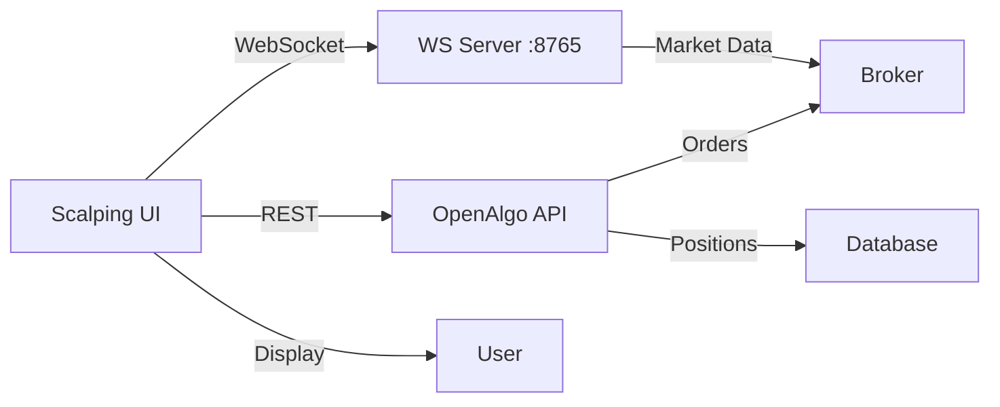

# Option Chain Scalping Interface - Implementation Plan

## Goal

Build a **premium web-based option chain scalping interface** that enables quick options trading with real-time data streaming. The interface will feature:

1. **Real-time option chain** for selected index (NIFTY/BANKNIFTY/SENSEX)
2. **Live WebSocket streaming** of option premiums
3. **One-click Buy/Sell buttons** for each strike
4. **Position tracking** with P&L display
5. **Quick CE/PE switching**
6. **Partial/Full exit** capabilities
7. **Quantity adjustment** on the fly

## User Requirements ✅ CONFIRMED

> [!NOTE]
> **Target Expiry**: Default to **current week's expiry** with dropdown options for:
> - Current Week Expiry (default)
> - Next Week Expiry  
> - Last Week of Month Expiry

> [!NOTE]
> **Strike Range**: **10 strikes on each side of ATM** (21 total strikes including ATM)

> [!NOTE]
> **Default Quantity**: **5 lots** by default with **+/- buttons** to adjust on the fly

> [!NOTE]
> **Order Type**: **MARKET** by default with **LIMIT** option toggle

> [!NOTE]
> **Hotkeys**: Enable/disable toggle with the following bindings:
> - **↑ (Up Arrow)**: Buy CE at selected strike
> - **↓ (Down Arrow)**: Buy PE at selected strike
> - **← (Left Arrow)**: Sell CE at selected strike
> - **→ (Right Arrow)**: Sell PE at selected strike
> - **F6**: Close all open positions (with confirmation)
> - **F7**: Close all pending orders (with confirmation)

## Proposed Changes

### New Files

#### [NEW] [scalping_interface.html](file:///c:/algo/openalgov2/openalgo/scalping_interface.html)

A standalone single-page application with:

**UI Components**:
- **Header**: Index selector (NIFTY/BANKNIFTY/SENSEX), expiry dropdown, connection status
- **Index Card**: Shows underlying LTP, change %, ATM strike with real-time updates
- **Option Chain Table**: 
  - Columns: CE Price, CE Label, Strike, PE Label, PE Price
  - Each row has Buy/Sell buttons for CE and PE
  - Color-coded: ITM (light green), ATM (yellow), OTM (light blue)
  - Real-time price updates via WebSocket
- **Positions Panel**: Shows open positions with P&L, Exit buttons (full/partial)
- **Quick Controls**: Quantity selector, CE/PE toggle, Market/Limit toggle

**Technology Stack**:
- Pure HTML5, CSS3, and Vanilla JavaScript (no framework for maximum speed)
- WebSocket for real-time data streaming
- Fetch API for REST calls (order placement, position fetching)
- Modern CSS Grid/Flexbox for responsive layout
- Dark theme optimized for long trading sessions

**Features**:
1. **Real-time Streaming**:
   - Connect to `ws://127.0.0.1:8765`
   - Authenticate with API key
   - Subscribe to all strikes in the option chain
   - Update prices in real-time (highlight changes)

2. **Order Execution**:
   - One-click Buy/Sell per strike
   - Uses `/api/v1/optionsorder` endpoint
   - Shows order confirmation toast
   - Auto-refreshes positions after order

3. **Position Management**:
   - Fetches positions from `/api/v1/positionbook`
   - Calculates live P&L using WebSocket prices
   - Exit buttons for each position (full/partial qty)
   - Color-coded: profit (green), loss (red)

4. **Design Aesthetics**:
   - **Dark theme** with vibrant accent colors (cyan, magenta, yellow)
   - **Glassmorphism** cards for modern look
   - **Smooth animations** on hover and updates
   - **Monospaced fonts** for numbers (better readability)
   - **Sticky header** with floating positions panel
   - **Micro-animations** for price changes (green up, red down)

---

## Technical Implementation Details

### WebSocket Integration

```javascript
// Connect to OpenAlgo WebSocket
const ws = new WebSocket('ws://127.0.0.1:8765');

// Authenticate
ws.send(JSON.stringify({
  action: 'authenticate',
  api_key: userApiKey
}));

// Subscribe to option chain
ws.send(JSON.stringify({
   action: 'subscribe',
  symbols: optionChainSymbols,  // Array of CE/PE symbols
  mode: 'QUOTE'
}));

// Handle real-time updates
ws.onmessage = (event) => {
  const tick = JSON.parse(event.data);
  updatePriceInUI(tick.symbol, tick.ltp, tick.change);
  updatePositionPnL(tick.symbol, tick.ltp);
};
```

### Order Placement Flow

```
1. User clicks "Buy CE" button at strike 24000
2. Get current LTP from WebSocket data
3. POST to /api/v1/optionsorder with:
   {
     "underlying": "NIFTY",
     "exchange": "NSE_INDEX",
     "expiry_date": "06FEB26",  // Current week
     "offset": "ITM2",  // Calculated from ATM
     "option_type": " CE",
     "action": "BUY",
     "quantity": "65",  // User-selected
     "pricetype": "MARKET",
     "product": "MIS"
   }
4. Show success toast with order ID
5. Refresh positions
```

### Position Management

```
1. Poll /api/v1/positionbook every 5 seconds
2. Match positions with WebSocket prices
3. Calculate P&L = (Current LTP - Buy Price) × Quantity
4. Display in positions panel
5. On exit click:
   - Full Exit: Place opposite order for full quantity
   - Partial Exit: Show modal to select quantity
```

---

## Data Flow Architecture



---

## Verification Plan

### Automated Tests
None - this is a standalone UI application.

### Manual Verification
1. **Open `scalping_interface.html` in browser**
2. **Enter API key** (from OpenAlgo dashboard)
3. **Select NIFTY** from dropdown
4. **Verify WebSocket connection** (status indicator turns green)
5. **Check option chain loads** with real-time prices
6. **Test Buy Order**:
   - Click "Buy CE" at any strike
   - Verify order placed successfully (check OpenAlgo dashboard)
   - Verify position appears in positions panel
7. **Test Price Updates**:
   - Watch prices update in real-time (should see micro-animations)
   - Verify P&L calculates correctly in positions panel
8. **Test Exit**:
   - Click "Exit" on a position
   - Verify opposite order placed
   - Verify position closed
9. **Test CE/PE Toggle**:
   - Click toggle to switch between CE and PE view
   - Verify correct prices displayed
10. **Test on mobile** (responsive design)

### Success Criteria
- ✅ WebSocket connects and streams data smoothly
- ✅ Option chain displays with correct labels (ITM/ATM/OTM)
- ✅ Orders execute within 1-2 seconds
- ✅ Positions update in real-time
- ✅ P&L calculation is accurate
- ✅ UI is responsive and fast (no lag on price updates)
- ✅ Interface looks premium and modern

---

## Future Enhancements (Not in this plan)

- Multi-leg strategy builder (spreads, straddles, strangles)
- Order book and trade log
- Greeks display (delta, gamma, theta, vega)
- Custom alerts on price levels
- Historical P&L charting
- Hotkey support for power users
